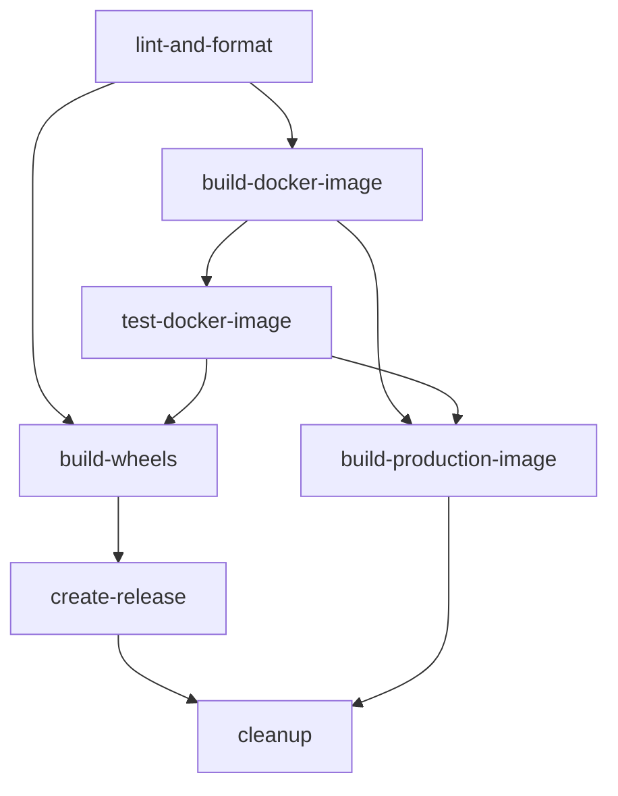

# GitHub Actions CI/CD Workflow Documentation

This document provides detailed documentation for the GitHub Actions CI/CD pipeline designed for the MLC-LLM project.

## Table of Contents

- [Workflow Overview](#workflow-overview)
- [Workflow Structure](#workflow-structure)
- [Job Dependencies](#job-dependencies)
- [Environment Variables](#environment-variables)
- [Secrets Configuration](#secrets-configuration)
- [Workflow Triggers](#workflow-triggers)
- [Job Details](#job-details)
- [Artifact Management](#artifact-management)
- [Troubleshooting](#troubleshooting)

## Workflow Overview

The CI/CD pipeline is designed with a modular approach, featuring 7 main jobs that handle different aspects of the build and deployment process:



## Workflow Structure

### File Location
```
.github/workflows/ci-cd.yml
```

### Core Components

1. **Workflow Triggers**: Defines when the pipeline runs
2. **Environment Variables**: Global configuration
3. **Job Definitions**: Individual workflow steps
4. **Matrix Strategies**: Cross-platform builds
5. **Conditional Execution**: Logic for different scenarios

## Job Dependencies

| Job | Depends On | Condition |
|-----|------------|----------|
| `lint-and-format` | None | Always |
| `build-docker-image` | `lint-and-format` | Success or force_build |
| `test-docker-image` | `build-docker-image` | Previous job success |
| `build-wheels` | `lint-and-format`, `test-docker-image` | Both succeed or force_build |
| `create-release` | `build-wheels`, `build-docker-image` | Tag push + both succeed |
| `build-production-image` | `build-wheels`, `test-docker-image` | Main branch or tag |
| `cleanup` | `create-release`, `build-production-image` | Always (cleanup) |

## Environment Variables

```yaml
env:
  REGISTRY: ghcr.io
  IMAGE_NAME: afzaal0007/mlc-llm-pipeline
  PYTHON_VERSION: '3.11'
  CMAKE_VERSION: '3.24'
```

### Variable Descriptions

- **REGISTRY**: Container registry for Docker images (GitHub Container Registry)
- **IMAGE_NAME**: Docker image name with username/repository format
- **PYTHON_VERSION**: Python version used across all jobs
- **CMAKE_VERSION**: Minimum CMake version required

## Secrets Configuration

### Required Secrets

| Secret Name | Purpose | Required For |
|-------------|---------|-------------|
| `GH_TOKEN` | GitHub Container Registry auth | Docker push, releases |

### Setting Up Secrets

1. Go to your repository on GitHub
2. Navigate to Settings → Secrets and variables → Actions
3. Click "New repository secret"
4. Add the following:

```
Name: GH_TOKEN
Secret: [Your GitHub Personal Access Token]
```

**Note**: The `GH_TOKEN` should have the following permissions:
- `read:packages`
- `write:packages`
- `contents:read`
- `contents:write` (for releases)

### Optional Secrets

| Secret Name | Purpose | Usage |
|-------------|---------|-------|
| `CODECOV_TOKEN` | Code coverage reporting | Coverage uploads |
| `SLACK_WEBHOOK_URL` | Notifications | Build status alerts |
| `DOCKER_HUB_USERNAME` | Docker Hub publishing | Alternative registry |
| `DOCKER_HUB_TOKEN` | Docker Hub authentication | Alternative registry |

## Workflow Triggers

### Push Events

```yaml
push:
  branches: [ main, develop ]
  tags: [ 'v*' ]
```

- **main branch**: Triggers full pipeline with production deployment
- **develop branch**: Triggers build and test (no production deployment)
- **tags (v*)**: Triggers full pipeline with GitHub release creation

### Pull Request Events

```yaml
pull_request:
  branches: [ main, develop ]
```

- Triggers validation pipeline (lint, build, test)
- No deployment or release creation
- Results displayed as PR checks

### Manual Trigger

```yaml
workflow_dispatch:
  inputs:
    force_build:
      description: 'Force build even if tests fail'
      required: false
      default: false
      type: boolean
```

- Allows manual pipeline execution from GitHub Actions UI
- `force_build` option bypasses test failures

## Job Details

### 1. Code Quality (`lint-and-format`)

**Purpose**: Validate code quality and formatting standards

**Steps**:
1. Checkout repository with submodules
2. Set up Python 3.11
3. Cache Python dependencies
4. Install linting tools (black, flake8, isort, mypy)
5. Run formatting checks
6. Run linting checks
7. Run import sorting validation

**Key Features**:
- Fails fast on critical formatting issues
- Caches dependencies for faster execution
- Conditional execution based on directory existence

### 2. Docker Build (`build-docker-image`)

**Purpose**: Build and publish development Docker image

**Steps**:
1. Checkout repository with submodules
2. Set up Docker Buildx
3. Login to GitHub Container Registry
4. Extract metadata for tagging
5. Build and push development image

**Key Features**:
- Multi-stage build targeting `development` stage
- Automatic tagging based on branch/tag
- BuildKit cache optimization
- Platform support: `linux/amd64`

**Generated Tags**:
- Branch-based: `main`, `develop`
- PR-based: `pr-123`
- Tag-based: `v1.0.0`, `1.0`, `1`
- SHA-based: `main-abcdef1`
- Latest: `latest` (default branch only)

### 3. Docker Testing (`test-docker-image`)

**Purpose**: Validate Docker image functionality

**Matrix Strategy**:
```yaml
matrix:
  test-type: [basic, import, help]
```

**Test Types**:
- **basic**: Run entrypoint help command
- **import**: Test Python environment
- **help**: Verify tool availability and versions

### 4. Wheel Building (`build-wheels`)

**Purpose**: Build cross-platform Python wheels

**Matrix Strategy**:
```yaml
matrix:
  include:
    - os: ubuntu-latest
      platform: linux
      arch: x64
    - os: windows-latest
      platform: windows
      arch: x64
```

**Build Process**:
1. Install platform-specific dependencies
2. Create mock MLC-LLM package structure
3. Build wheel using `python -m build`
4. Test wheel installation
5. Upload as artifacts

**Artifacts**:
- `wheels-linux-x64`: Linux wheels
- `wheels-windows-x64`: Windows wheels
- Retention: 30 days

### 5. Release Creation (`create-release`)

**Purpose**: Create GitHub releases with wheel artifacts

**Trigger Conditions**:
- Tag push starting with 'v'
- Successful wheel and Docker builds

**Process**:
1. Download all wheel artifacts
2. Prepare release assets
3. Create GitHub release with:
   - Auto-generated release notes
   - Wheel attachments
   - Prerelease marking for alpha/beta/rc tags

### 6. Production Image (`build-production-image`)

**Purpose**: Build minimal production Docker image

**Trigger Conditions**:
- Main branch push
- Tag push starting with 'v'

**Features**:
- Targets `production` stage in Dockerfile
- Minimal runtime dependencies
- Security-focused build
- Production-specific tagging

**Generated Tags**:
- `main-prod`
- `v1.0.0-prod`
- `prod` (default branch)

### 7. Cleanup (`cleanup`)

**Purpose**: Remove old package versions

**Configuration**:
- Keep minimum 10 versions
- Delete only untagged versions
- Runs regardless of previous job status

## Artifact Management

### Build Artifacts

| Artifact | Content | Retention | Usage |
|----------|---------|-----------|-------|
| `wheels-linux-x64` | Linux Python wheels | 30 days | GitHub releases |
| `wheels-windows-x64` | Windows Python wheels | 30 days | GitHub releases |

### Docker Images

| Image Type | Tag Pattern | Purpose |
|------------|-------------|----------|
| Development | `latest`, `main`, `develop` | Development and CI |
| Production | `prod`, `main-prod`, `v1.0.0-prod` | Production deployment |

## Best Practices Implemented

### 1. Caching Strategy

```yaml
- name: Cache Python dependencies
  uses: actions/cache@v3
  with:
    path: ~/.cache/pip
    key: ${{ runner.os }}-pip-lint-${{ hashFiles('**/requirements*.txt', '**/pyproject.toml') }}
    restore-keys: |
      ${{ runner.os }}-pip-lint-
      ${{ runner.os }}-pip-
```

### 2. Conditional Execution

```yaml
if: always() && (needs.lint-and-format.result == 'success' || github.event.inputs.force_build == 'true')
```

### 3. Matrix Builds

```yaml
strategy:
  fail-fast: false
  matrix:
    include:
      - os: ubuntu-latest
        platform: linux
        arch: x64
```

### 4. Secure Secret Handling

```yaml
env:
  GITHUB_TOKEN: ${{ secrets.GH_TOKEN }}
```

## Monitoring and Observability

### Workflow Status

- **Badge**: Displays current workflow status in README
- **Notifications**: Can be configured with Slack webhooks
- **Email**: GitHub sends email notifications on failures

### Build Metrics

- **Duration**: Tracked per job and overall workflow
- **Success Rate**: Visible in Actions tab
- **Artifact Sizes**: Displayed in workflow summary

### Logs

- **Detailed Logs**: Available for each step
- **Downloadable**: Can be downloaded as ZIP
- **Retention**: 30 days for public repos

## Troubleshooting

### Common Issues

#### 1. Authentication Failures

**Error**: 
```
Error: buildx failed with: ERROR: failed to solve: failed to authorize
```

**Solution**:
- Verify `GH_TOKEN` secret is set correctly
- Ensure token has `write:packages` permission
- Check token expiration

#### 2. Build Failures

**Error**:
```
Error: Docker build failed
```

**Debugging Steps**:
1. Check Dockerfile syntax
2. Verify base image availability
3. Check build context size
4. Review build logs for specific errors

#### 3. Test Failures

**Error**:
```
Some tests failed
```

**Investigation**:
1. Review test output in logs
2. Check if issue is environment-specific
3. Verify test dependencies
4. Use `force_build` for emergency bypasses

#### 4. Release Creation Issues

**Error**:
```
Failed to create release
```

**Common Causes**:
- Tag already exists
- Insufficient permissions
- Invalid tag format
- Missing artifacts

### Debug Strategies

#### 1. Enable Debug Logging

```yaml
- name: Debug Information
  run: |
    echo "Runner OS: ${{ runner.os }}"
    echo "GitHub Event: ${{ github.event_name }}"
    echo "GitHub Ref: ${{ github.ref }}"
    env
```

#### 2. Matrix Job Debugging

```yaml
- name: Debug Matrix
  run: |
    echo "Platform: ${{ matrix.platform }}"
    echo "OS: ${{ matrix.os }}"
    echo "Arch: ${{ matrix.arch }}"
```

#### 3. Conditional Logic Testing

```yaml
- name: Debug Conditions
  run: |
    echo "Is main branch: ${{ github.ref == 'refs/heads/main' }}"
    echo "Is tag: ${{ startsWith(github.ref, 'refs/tags/v') }}"
    echo "Force build: ${{ github.event.inputs.force_build }}"
```

## Performance Optimization

### 1. Parallel Execution

- Jobs run in parallel where dependencies allow
- Matrix strategies enable concurrent platform builds
- Docker BuildKit provides parallel layer builds

### 2. Caching

- Python dependencies cached per platform
- Docker layers cached using GitHub Actions cache
- Git submodules cached when possible

### 3. Resource Management

- Use `nproc` for optimal parallel compilation
- Appropriate runner types for workload
- Efficient artifact handling

## Security Considerations

### 1. Secret Management

- Secrets never logged or exposed
- Minimal permission tokens
- Regular token rotation recommended

### 2. Container Security

- Base images from official sources
- Regular security scanning
- Minimal attack surface in production images

### 3. Code Security

- Dependency scanning
- Static analysis integration
- Secure build practices

## Extending the Workflow

### Adding New Jobs

1. Define job in workflow file
2. Set appropriate dependencies
3. Add conditional logic if needed
4. Test thoroughly

### Adding New Platforms

1. Extend matrix strategy
2. Add platform-specific steps
3. Update artifact naming
4. Test build and deployment

### Integration Points

- **Code Coverage**: Add Codecov integration
- **Security Scanning**: Integrate security tools
- **Notifications**: Add Slack/Teams webhooks
- **Quality Gates**: Add additional quality checks

---

**Need help with the workflow?** Check the [troubleshooting guide](troubleshooting.md) or [open an issue](https://github.com/afzaal0007/mlc-llm-pipeline/issues).

